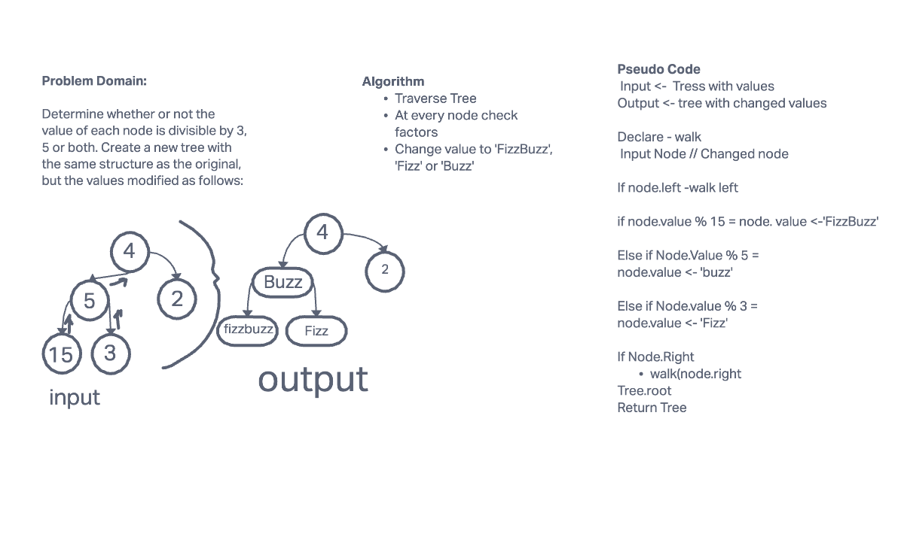

# Code Challenge: Class 18 FizzBuzz
Determine whether or not the value of each node is divisible by 3, 5 or both. Create a new tree with the same structure as the original, but the values modified as follows:

## Whiteboard Process

## Approach & Efficiency
My approach was to walk left until I reached the end of the tree and then I stayed on the current node and evaluated it.
**Big O** - Time O(n) Space O(h) h being height of tree
## Solution
solution located at tree-fizz-buzz.js
